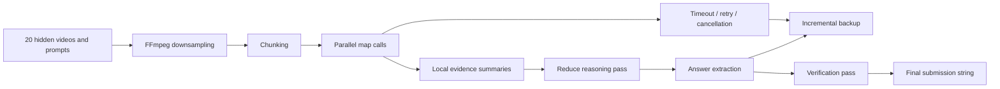

# VideoAgent

Round 2 Day 2 problem. The task was to answer 20 video questions within a strict 15-minute submission window after receiving the hidden videos and prompts.

## Why This Problem Matters

This was the most engineering-heavy problem in the finals. A naive approach of uploading full videos to a multimodal model is slow, expensive, and fragile under a 15-minute deadline. The core challenge was to build an agent harness that could compress media, run many calls safely, preserve partial answers, and still leave enough time for final verification.

## Agent Harness

## Repository Layout

- `original-submission/`: contest-time VideoAgent V3 files.
- `post-contest-before-review/`: self-improved version made before reading the organizer review.
- `refined-after-review/`: planned folder for a new solution based on organizer intent.
- `intent-notes.md`: problem intent and next implementation plan.

## Original Direction

The original approach used FFmpeg downsampling, chunking, Gemini-based Map-Reduce, and incremental answer backup.

Key design choices:

- Downsample video with FFmpeg to reduce upload and inference latency.
- Split long videos into chunks so each prompt could be answered from smaller evidence windows.
- Use a map-reduce style flow: extract local observations first, then ask a stronger reasoning pass to decide the answer.
- Save intermediate answer strings so a partial submission could survive late-stage failures.

## Post-Contest Finding

The immediate self-review identified missing hard timeouts, zombie async tasks, and retry logic that reused exhausted API keys.

The main lesson was that model quality was not the only bottleneck. In a timed environment, reliability details become scoring details:

- Upload polling needs a hard timeout and cancellation path.
- Parallel tasks need failure isolation so one stalled video does not block all answers.
- Retry logic should rotate keys or clients after rate-limit failures instead of reusing the same exhausted path.
- Temporary chunks should be cleaned up even when a worker fails.

## Refined Direction

The organizer review emphasizes agent harness design: frame/audio sampling, evaluation set construction, multi-pass reasoning, verification, and fallback strategies.

Planned refined version:

1. Build a small public-safe eval set with synthetic or user-provided sample clips.
2. Separate media preprocessing, model calls, answer extraction, and verification into testable modules.
3. Add timeout, retry, cancellation, and cleanup guarantees around every external call.
4. Add a verification pass that checks whether the selected option is grounded in extracted evidence.
5. Log per-video latency, retry count, and confidence notes for post-run analysis.

## Hiring Signal

This problem shows practical LLMOps and agent-engineering thinking: not just prompting a multimodal model, but designing the surrounding system so that model calls can finish under latency, quota, and failure constraints.
