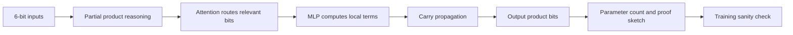

# MultiplierBoard

Round 1 Day 1 problem. The goal was to design a compact Transformer architecture that can multiply two 6-bit binary numbers.

## Why This Problem Matters

This problem was not mainly about training a large model. It tested whether a participant could reason about what a small Transformer can compute: bit routing through attention, local computation through MLPs, carry propagation, parameter count, and whether the architecture is actually sufficient for binary multiplication.

## Solution Flow

## Repository Layout

- `original-submission/`: contest-time code and reports.
- `intent-notes.md`: organizer review based interpretation.

## Original Submission

The submitted approach used a 2-layer Transformer structure, parameter counting, weight tying, and a trained 16-dimensional configuration that reached high accuracy under the fixed protocol.

Key observations:

- Multiplication can be decomposed into partial products and carry propagation.
- Attention is useful for routing relevant input bits into the positions where each output bit is computed.
- A compact architecture needs an explicit argument for why each layer or head is necessary.
- The trained configuration provides empirical support, but the stronger artifact is a clear construction/proof.

## Next Refined Work

Future work should make the hand-proof clearer: which attention head routes which bits, what each MLP block computes, and why carry propagation requires at least two layers.

Planned refined version:

1. Add a layer-by-layer diagram of bit flow.
2. Separate the constructive proof from the empirical training experiment.
3. Clarify which parts are exact reasoning and which parts are learned approximation.
4. Add a concise parameter-count table for the proposed architecture.

## Hiring Signal

This problem is useful as a portfolio artifact because it shows mechanistic reasoning about model architecture rather than only API usage. It demonstrates that I can think about what a model class can represent and how to justify that design.
